# Layouts
All the grids that can be used in the game

## Grids

- capsuleClassic<br>
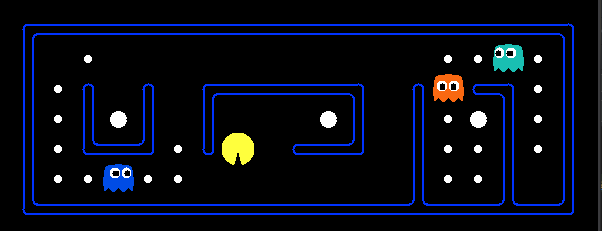
- contestClassic<br>
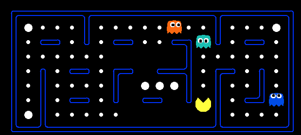
- mediumClassic<br>
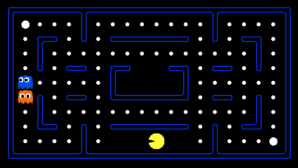
- mediumGrid<br>
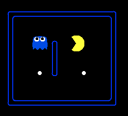
- minimaxClassic<br>
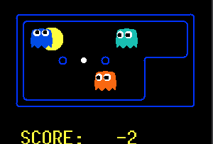
- openClassic<br>
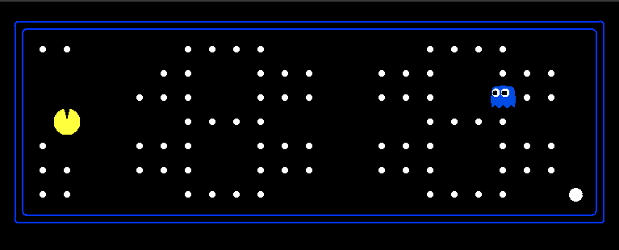
- originalClassic<br>
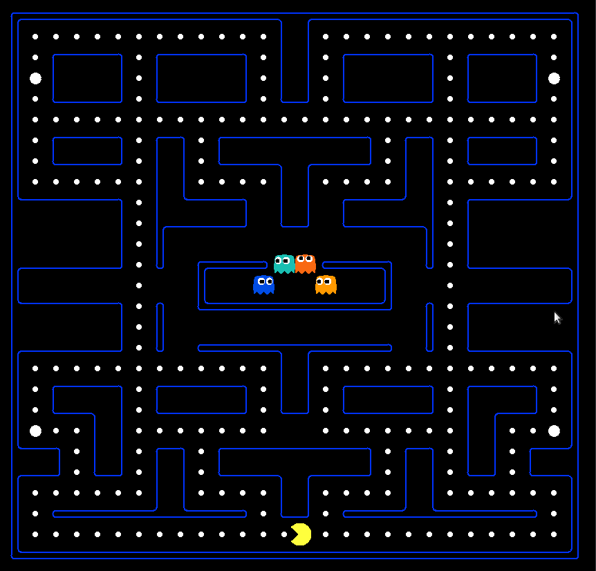
- smallClassic<br>
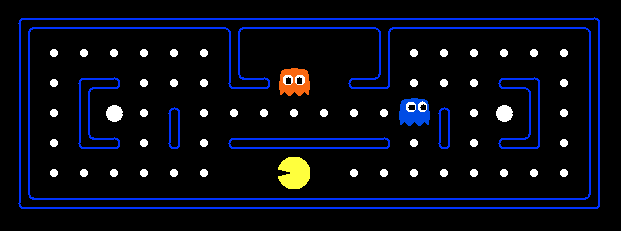
- smallGrid<br>
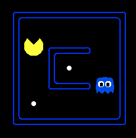
- testClassic<br>
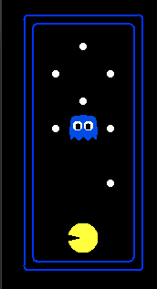
- trappedClassic<br>
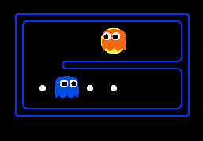
- trickyClassic<br>
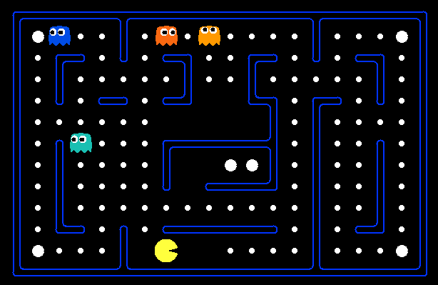

# How to chose the layout

When you run a model, put the name of the layout with the option '-l'
Example: 

```
$ python3 pacman.py -p PacmanDQN -n 6000 -x 5000 -l originalClassic
```

# Layouts
Different layouts can be found and created in the `layouts` directory

# Creation
You can create a layout easily by creating a '.lay' file in this directory.
You can draw your own grid with some special characters.
Example (smallGrid.lay): 

```
%%%%%%%%%%%%%%%%%%%%
%......%G  G%......%
%.%%...%%  %%...%%.%
%.%o.%........%.o%.%
%.%%.%.%%%%%%.%.%%.%
%........P.........%
%%%%%%%%%%%%%%%%%%%%
```

- % draws a wall
- G draws the spawn of the ghosts
- P draws the spawn of pacman
- o draws an energizer item (allow pacman to eat the ghosts during a period of time)
- . draws the dots pacman has to eat